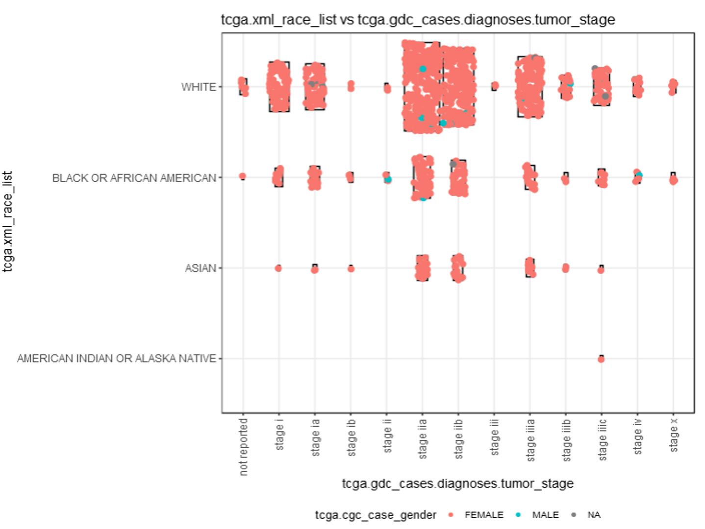
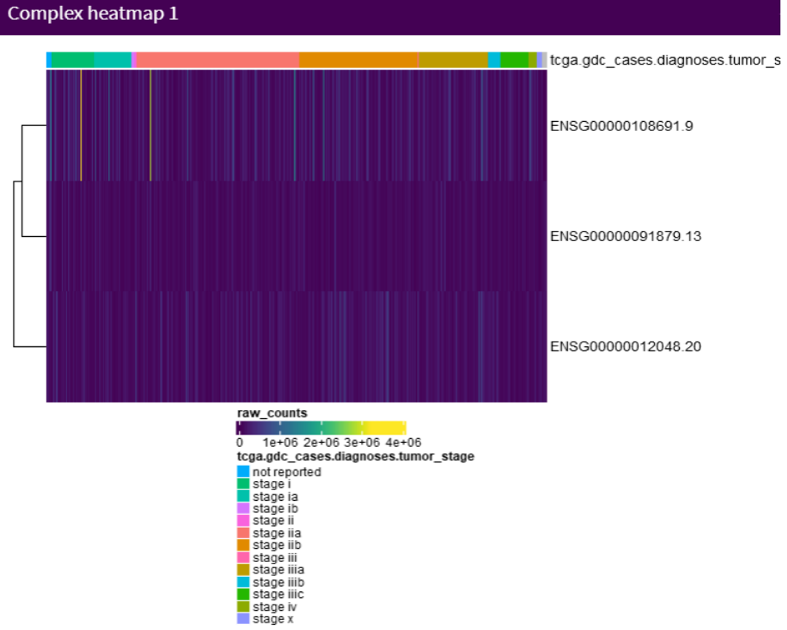
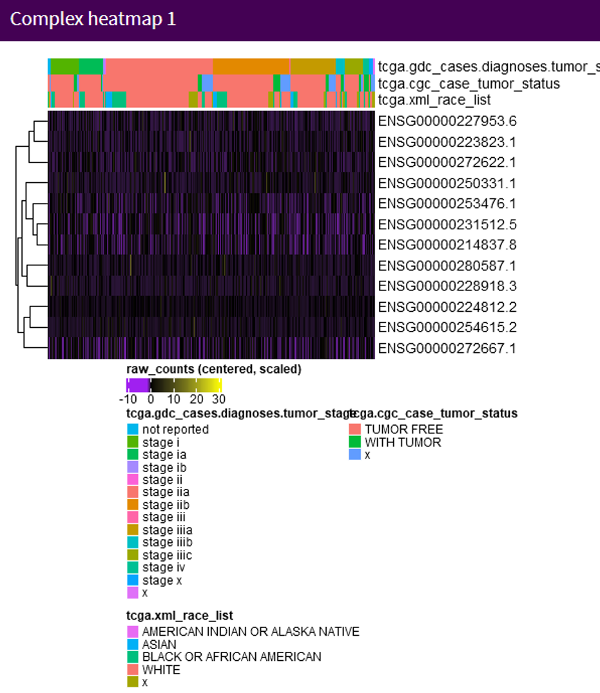

```{r setup, include=FALSE}
knitr::opts_chunk$set(echo = TRUE)
```

```{r}
## Load recount3 R package
library("recount3")
```

```{r}
human_projects <- available_projects()
```


```{r}
proj_info <- subset(
    human_projects,
    project == "BRCA" & project_type == "data_sources"
)
## Crea un objeto de tipo RangedSummarizedExperiment (RSE)

rse_gene_BRCA <- create_rse(proj_info)
```

```{r}
rse_gene_BRCA
```

```{r}
##Explorar el objeto
#dim(rse_gene_BRCA)
#head(dimnames(rse_gene_BRCA))
#rowRanges(rse_gene_BRCA)
#colData(rse_gene_BRCA)
#rse_gene_BRCA$melanoma
```


```{r}
assay(rse_gene_BRCA, "counts") <- compute_read_counts(rse_gene_BRCA)
```

```{r}
rse_gene_BRCA 
```

```{r}
##Explorar los datos y graficarlos
library("iSEE")
iSEE::iSEE(rse_gene_BRCA)
```




En la imagen podemos observar que la raza blanca es la que mayor incidencia de cáncer de mama; mientras que las razas nativas americanas no se ven tan afectadas por este tipo de cáncer.
Además, podemos ver que la raza asiática tiene menor incidencia de cáncer  de mama por BRCA en sus estadios más avanzados



Se puede observar que al clusterizar, los genes ANGPT2 y CCl2 están mas relacionados entre sí que BRCA1, esto debido a que ambos son genes involucrados en metástasis. Sin embargo, no hubo DE significativa comparado entre estadios avanzados e iniciales, contrario a lo que esperaria, especialmente con ANGPT2 y CCL2 debido a su rol en angiogénesis y respuesta inmune respectivamente, y que ayuda a la metástasis.
[genes implicados en metastasis cerebral](https://www.sciencedirect.com/science/article/pii/S0304383508008896?casa_token=kGj2RtqfzJwAAAAA:PvTcsePbxomwIoPUznF24XOgQbuvzt97CTFOveqdoqUBMKsTcJt5mn3A11A1aTyCU4B9hgUU6_l_) a partir de cáncer de mama

```{r}
#Quitar los NA
rse_gene_BRCA$tcga.cgc_case_tumor_status[is.na(rse_gene_BRCA$tcga.cgc_case_tumor_status)] <- 'x'
rse_gene_BRCA$tcga.gdc_cases.diagnoses.tumor_stage[is.na(rse_gene_BRCA$tcga.gdc_cases.diagnoses.tumor_stage)] <- 'x'
rse_gene_BRCA$`recount_qc.bc_auc.all_%`[is.na(rse_gene_BRCA$`recount_qc.bc_auc.all_%`)] <- 0
rse_gene_BRCA$tcga.xml_race_list[is.na(rse_gene_BRCA$tcga.xml_race_list)] <- 'x'
rse_gene_BRCA$recount_qc.gene_fc_count_all.assigned[is.na(rse_gene_BRCA$recount_qc.gene_fc_count_all.assigned)] <- 'x'
```


```{r}
rse_gene_BRCA$tcga.cgc_slide_percent_lymphocyte_infiltration <- as.numeric(rse_gene_BRCA$tcga.cgc_slide_percent_lymphocyte_infiltration)
rse_gene_BRCA$tcga.gdc_cases.diagnoses.tumor_stage <- factor(rse_gene_BRCA$tcga.gdc_cases.diagnoses.tumor_stage)
rse_gene_BRCA$tcga.cgc_case_tumor_status <- factor(rse_gene_BRCA$tcga.cgc_case_tumor_status)
#Las comillas escapan al símbolo %
rse_gene_BRCA$`recount_qc.bc_auc.all_%`<-as.numeric(rse_gene_BRCA$`recount_qc.bc_auc.all_%`)
##auc is area under the curve, is a metric in transcriptomics
rse_gene_BRCA$tcga.xml_race_list <- factor(rse_gene_BRCA$tcga.xml_race_list)
rse_gene_BRCA$recount_qc.gene_fc_count_all.assigned <- as.numeric(rse_gene_BRCA$recount_qc.gene_fc_count_all.assigned)
```


```{r}
summary(rse_gene_BRCA$`recount_qc.bc_auc.all_%`)
```

```{r}
with(colData(rse_gene_BRCA), plot(tcga.cgc_case_tumor_status, `recount_qc.bc_auc.all_%`))
```


```{r}
##Diferencias entre tumor y free tumor

with(colData(rse_gene_BRCA), tapply( `recount_qc.bc_auc.all_%`,tcga.cgc_case_tumor_status,summary))
```

```{r}
##Diferencias entre clasificaciones

with(colData(rse_gene_BRCA), tapply(`recount_qc.bc_auc.all_%`,tcga.gdc_cases.diagnoses.tumor_stage,summary))

```

Se puede observar que no existen diferencias significativas por lo que vamos a quitar muestras no informativas

```{r}
## Guardemos nuestro objeto entero 
rse_gene_BRCA_unfiltered <- rse_gene_BRCA
##Graficar para ver un umbral adecuado
hist(rse_gene_BRCA$`recount_qc.bc_auc.all_%`)
```

```{r}
##Visualizar cuantas muestras no alcanzan el umbral
table(rse_gene_BRCA$`recount_qc.bc_auc.all_%` < 130)
```

```{r}
rse_gene_BRCA <- rse_gene_BRCA[, rse_gene_BRCA$`recount_qc.bc_auc.all_%` > 130]

```

```{r}
##Eliminando genes 
gene_means <- rowMeans(assay(rse_gene_BRCA, "counts"))
summary(gene_means)

```

```{r}
#Se eliminará genes debajo del quartile 1

## Eliminamos genes
rse_gene_BRCA <- rse_gene_BRCA[gene_means > 1.4, ]

## Dimensiones finales
dim(rse_gene_BRCA)
```
```{r}
library("edgeR")
```
```{r}
rse_gene_BRCA_unfiltered
```

```{r}
## Porcentaje de genes que retuvimos
round(nrow(rse_gene_BRCA) / nrow(rse_gene_BRCA_unfiltered) * 100, 2)
```


```{r}
dge <- DGEList(
    counts = assay(rse_gene_BRCA, "counts"),
    genes = rowData(rse_gene_BRCA)
)
dge <- calcNormFactors(dge)
```

```{r}
library("ggplot2")
ggplot(as.data.frame(colData(rse_gene_BRCA)), aes(y = rse_gene_BRCA$`recount_qc.bc_auc.all_%`, 
                                                  x = rse_gene_BRCA$tcga.gdc_cases.diagnoses.tumor_stage)) +
    geom_boxplot() +
  ylab("AUC") +
    xlab("TumorStage")+
    theme(text = element_text(size=20),
          axis.text.x = element_text(angle=90, hjust=1)) 
    
```

```{r}
library("ggplot2")
ggplot(as.data.frame(colData(rse_gene_BRCA)), aes(y = rse_gene_BRCA$`recount_qc.bc_auc.all_%`, 
                                                  x = rse_gene_BRCA$tcga.cgc_case_tumor_status)) +
    geom_boxplot() +
  ylab("AUC") +
    xlab("Status")+
    theme(text = element_text(size=20),
          axis.text.x = element_text(angle=90, hjust=1)) 
```


```{r}
mod <- model.matrix(~ rse_gene_BRCA$tcga.cgc_case_tumor_status + rse_gene_BRCA$`recount_qc.bc_auc.all_%`  + rse_gene_BRCA$tcga.gdc_cases.diagnoses.tumor_stage + rse_gene_BRCA$tcga.xml_race_list,
    data = colData(rse_gene_BRCA)
)
#colnames(mod)
```

```{r}
library("limma")

vGene <- voom(dge, mod, plot = TRUE)
```

```{r}
eb_results <- eBayes(lmFit(vGene))

de_results <- topTable(
    eb_results,
    coef = 2,
    number = nrow(rse_gene_BRCA),
    sort.by = "none"
)
dim(de_results)
```
```{r}
head(de_results)

```

```{r}
## Genes diferencialmente expresados entre tumor y free tumor con FDR < 5%
table(de_results$adj.P.Val < 0.05)
```
```{r}
## Visualicemos los resultados estadísticos
limma::plotMA(eb_results, coef = 2)
```


```{r}
volcanoplot(eb_results, coef = 2, highlight = 3, names = de_results$gene_name)
```

```{r}
iSEE::iSEE(rse_gene_BRCA)
```

Derivado del VolcanoPlot, se sugiere estudiar los genes.
Los genes con mayor expresión diferencial entre tumor y tumor free fueron
LINC01348
LINC01340
y ambos se caracterizan por estar expresados en el estadio 2a y mayormente en raza white


